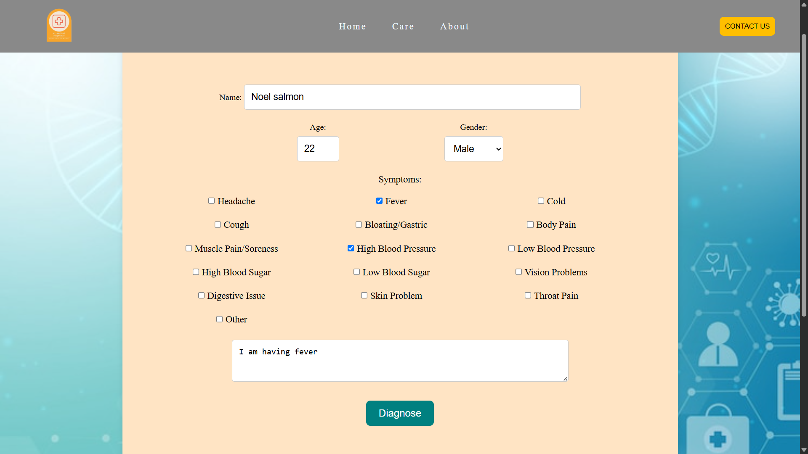
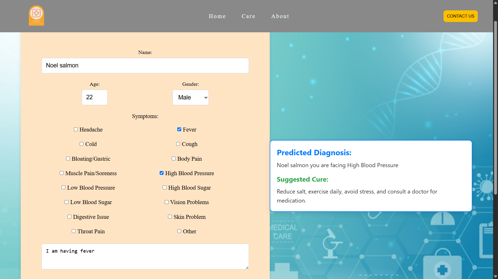

# 🧠 AI Medical Diagnosis

A simple web-based AI-powered medical symptom checker built using HTML, CSS, JavaScript, and Python (Flask).

## 🚀 Features

- User-friendly interface for entering symptoms
- AI-based backend to analyze symptoms
- Dynamic and animated front-end
- Multi-page structure: Home, About, and Care

## 🗂️ Project Structure

```
├── index.html          # Homepage with symptom form
├── about.html          # Info about the project
├── care.html           # Additional content/help
├── style.css           # CSS styling
├── script.js           # JavaScript for interactivity
├── app.py              # Flask backend for AI diagnosis
├── .git/               # Git version control
```

## 🛠️ Technologies Used

- **Frontend**: HTML5, CSS3, JavaScript
- **Backend**: Python (Flask)
- **Version Control**: Git

## 💻 How to Run Locally

1. **Clone the repository**
   ```bash
   git clone https://github.com/your-username/ai-medical-diagnosis.git
   cd ai-medical-diagnosis
   ```

2. **Install dependencies**  
   Make sure Python is installed.
   ```bash
   pip install flask
   ```

3. **Run the server**
   ```bash
   python app.py
   ```

4. **Open in browser**
   Visit: `http://127.0.0.1:5000`

## 📁 Pages Overview

- `/index.html` – Main page with the form
- `/about.html` – Description of the system
- `/care.html` – Health tips / contact info (customizable)

## 📷 Screenshots




## 📜 License

This project is open-source and available under the [MIT License](LICENSE).

## 🙌 Acknowledgments

- OpenAI for concept inspiration
- Flask documentation
- Frontend web development community
